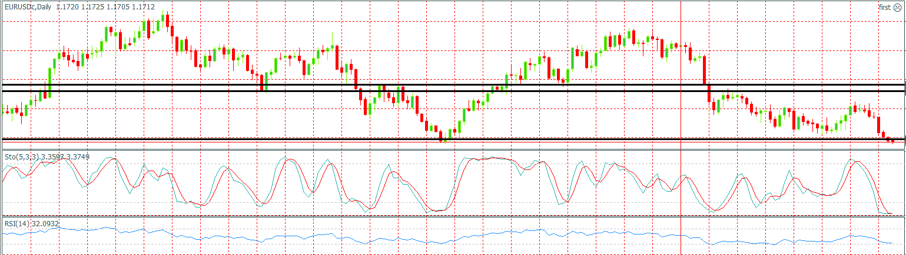
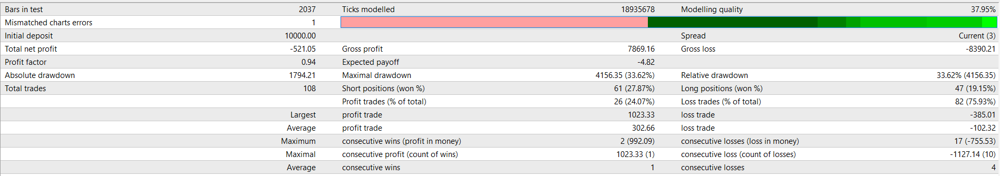

_ we are going to place a buy order when the previous candle is closed upper than MA indicator.otherwise we are going to have a sell order.

- again EURUSD CHART and testing for about 11 years.

#### EURUSD CHART

#### REPORT
