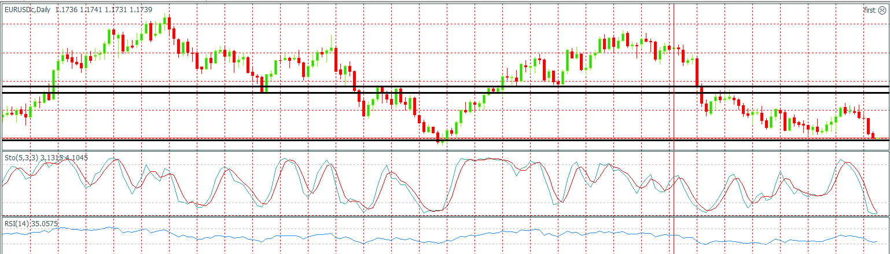
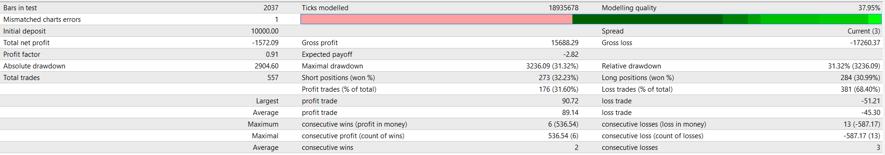

- this Simple expert in mql4 compares The previous two candles. When these two candles are bullish, a buy order is placed and otherwise a sell order is placed.

- ** This simple expert is just for learning not trading **

- I tested this expert on EURUSD chart from 2010 to 2021 and the following results are visible:

#### EURUSD CHART

#### REPORTS OF BACKTEST
